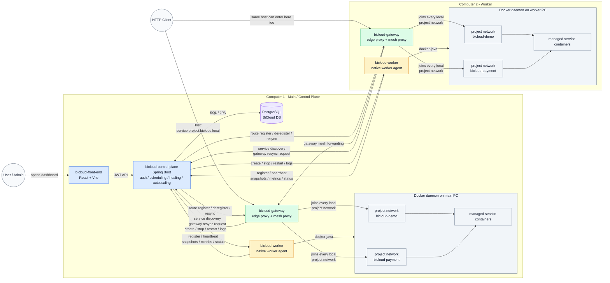

# BiCloud

BiCloud is a lightweight, multi-machine container orchestration platform for
stateless HTTP services. It lets users create projects, define services from
Docker images, choose replica counts and CPU/RAM limits, deploy those services
onto registered worker machines, expose them through a dynamic gateway, monitor
their health, and recover from failures automatically.

The easiest way to describe the project is:

> BiCloud is a Kubernetes-inspired mini PaaS built from scratch with Spring
> Boot, Docker, PostgreSQL, Spring Cloud Gateway, and React. It focuses on the
> core infrastructure ideas behind cloud platforms: desired state, scheduling,
> worker agents, health checks, self-healing, autoscaling, service discovery,
> dynamic routing, and tenant network isolation.

BiCloud is not a Kubernetes replacement. It does not implement Kubernetes APIs,
Pods, CRDs, CNI, kube-proxy, etcd, or a production-grade scheduler. The goal is
to provide a focused orchestration layer for stateless HTTP services while
keeping the system compact, operable, and easy to extend.

## Table of Contents

- [Project Summary](#project-summary)
- [Design Goals](#design-goals)
- [Scope](#scope)
- [High-Level Architecture](#high-level-architecture)
- [Components](#components)
- [Core Features](#core-features)
- [Scheduling Model](#scheduling-model)
- [Autoscaling Model](#autoscaling-model)
- [Self-Healing and Reconciliation](#self-healing-and-reconciliation)
- [Networking and Routing](#networking-and-routing)
- [Security Model](#security-model)
- [Data Model](#data-model)
- [Frontend](#frontend)
- [Repository Layout](#repository-layout)
- [Running Locally](#running-locally)
- [Multi-Machine Setup](#multi-machine-setup)
- [Typical Usage Scenario](#typical-usage-scenario)
- [API Overview](#api-overview)
- [Testing](#testing)
- [Limitations and Future Work](#limitations-and-future-work)
- [Troubleshooting](#troubleshooting)

## Project Summary

BiCloud turns Docker from a single-machine tool into a small platform:

1. A user logs into the frontend.
2. The user creates a project.
3. The user adds one or more HTTP services using Docker image names.
4. The user configures replicas, resource limits, environment variables,
   internet egress, external exposure, and optional autoscaling.
5. The control plane selects worker machines.
6. Worker agents create Docker containers on their local machines.
7. Gateways expose the service to external traffic and mesh-style internal
   service-to-service calls.
8. Background schedulers monitor workers, containers, metrics, desired replica
   counts, and gateway routes.
9. If something drifts, BiCloud reconciles the system back toward the desired
   state.

The project is intentionally centered on stateless HTTP services. Persistent
volumes and raw TCP/L4 services are outside the current scope by design.

## Design Goals

BiCloud is designed around a small set of infrastructure goals:

- deploy stateless HTTP services from Docker images,
- place replicas across multiple worker machines,
- make scheduling decisions from resource usage, reservations, and worker
  health,
- keep desired state and runtime state reconciled,
- expose services through dynamic HTTP routing,
- support internal service discovery between services in the same project,
- isolate tenants with Docker networks,
- protect internal machine-to-machine APIs,
- provide an operational UI for users and administrators.

## Scope

### In Scope

BiCloud supports:

- stateless HTTP services,
- Docker image based deployment,
- multiple worker machines,
- service replicas,
- CPU and memory limits,
- CPU-based autoscaling,
- worker health monitoring,
- container health monitoring,
- self-healing,
- dynamic HTTP routing,
- project-level network isolation,
- optional admin-controlled internet egress,
- internal service-to-service mesh routing,
- container logs,
- live container metrics,
- audit events,
- user and admin roles.

### Out of Scope by Design

BiCloud currently does not try to support:

- persistent volumes,
- stateful database hosting as a managed product,
- raw TCP/L4 routing,
- UDP services,
- Kubernetes compatibility,
- image build pipelines,
- automatic public DNS management,
- production certificate automation.

This keeps the project focused: BiCloud is a stateless HTTP service runner, not
a full cloud provider.

## High-Level Architecture



There are two main traffic paths:

- **Control traffic:** frontend -> control plane <-> workers/gateways. These
  calls configure desired state, schedule replicas, create containers, update
  gateway routes, replay routes after gateway restart, and report
  heartbeat/metrics.
- **Application traffic:** external HTTP clients -> gateway -> service
  container. If the target replica is on another machine, the local gateway can
  forward the request to the remote gateway.

The gateway is intentionally attached to every managed project Docker network on
its own machine. This is the core routing idea: application containers stay
isolated inside project networks, while one trusted gateway container can enter
those networks and proxy HTTP traffic to the correct service instance. A gateway
does not directly join Docker networks on another machine; cross-machine traffic
goes gateway -> gateway over the mesh, then the remote gateway enters its own
local Docker networks.

### Control Plane

The control plane is the source of truth. It owns:

- users,
- projects,
- service definitions,
- worker records,
- container instance records,
- audit events,
- scheduling decisions,
- autoscaling decisions,
- self-healing and reconciliation loops.

It stores persistent state in PostgreSQL.

### Worker

Each worker runs on a machine that can execute Docker containers. The worker:

- registers with the control plane,
- reports heartbeat and machine resource usage,
- creates containers,
- applies CPU/RAM limits,
- creates Docker networks,
- enforces project isolation,
- sends container snapshots and metrics,
- reports dead containers,
- exposes log/stop/remove operations to the control plane.

### Gateway

Each machine runs a gateway container. The gateway:

- receives route registrations from the control plane,
- exposes services as HTTP hostnames,
- load-balances between local service replicas,
- forwards traffic to another machine's gateway when needed,
- provides internal mesh-style service discovery,
- joins every managed project Docker network on its own machine,
- acts as the trusted bridge between isolated service networks and HTTP traffic,
- prunes stale route entries.

### Frontend

The frontend is the management interface for users and admins. It exposes:

- projects,
- services,
- deployments,
- scaling,
- autoscaling policy configuration,
- workers,
- containers,
- logs,
- metrics,
- audit timeline,
- admin user management.

## Components

| Component | Stack | Responsibility |
| --- | --- | --- |
| `bicloud-control-plane` | Java 21, Spring Boot, Spring Security, JPA, PostgreSQL | Central API, auth, projects, services, workers, scheduling, autoscaling, self-healing, audit |
| `bicloud-worker` | Java 21, Spring Boot, docker-java | Per-machine Docker lifecycle, networks, logs, metrics, heartbeat |
| `bicloud-gateway` | Java 21, Spring Cloud Gateway, WebFlux, docker-java | Dynamic HTTP routing, mesh routing, gateway resync, network discovery |
| `bicloud-front-end` | React 19, Vite, Axios, React Router | User/admin dashboard and project operations UI |
| Compose files | Docker Compose | Role/OS-specific PostgreSQL and gateway startup |

## Core Features

### Authentication and Roles

- Users authenticate with JWT.
- Passwords are stored using BCrypt.
- There are two roles: `USER` and `ADMIN`.
- Normal users manage their own projects.
- Admins can manage users, inspect all workers, drain/resume workers, and
  trigger gateway resync.

### Project and Service Management

- A project represents a tenant.
- A service belongs to a project.
- Each service defines:
  - Docker image,
  - service name,
  - container port,
  - desired replicas,
  - CPU limit,
  - memory limit,
  - environment variables,
  - external exposure policy,
  - internet egress policy,
  - autoscaling policy.

### Replica Management

- Users can scale a service from 0 to 10 replicas.
- Scale-up starts missing replicas asynchronously.
- Scale-down deregisters excess containers from the gateway, stops them on the
  worker, removes them, and marks them as `STOPPED`.
- Self-healing keeps actual replicas close to desired replicas.

### Autoscaling

- Autoscaling is configured per service.
- It uses container CPU metrics.
- It stores recent service-level CPU samples.
- It scales up by +1 when the recent average is above the target threshold.
- It scales down by -1 when the recent average is below the scale-down
  threshold.
- Cooldowns prevent rapid oscillation.

### Worker Scheduling

Worker selection uses:

- live CPU usage,
- live memory usage,
- reserved CPU/RAM from already assigned `RUNNING` and `PENDING` containers,
- same-service soft anti-affinity,
- worker health status.

This means BiCloud does not blindly round-robin. It tries to spread replicas,
but still prefers healthier and emptier workers.

### Tenant Isolation

- Each project gets its own Docker bridge network.
- Project networks are internal by default.
- Containers are removed from Docker's default `bridge` network before start.
- Services cannot reach the public internet unless an admin enables egress.
- Internal mesh routing rejects cross-project access.

### Dynamic Gateway Routing

External route format:

```text
http://{service}.{project}.bicloud.local:9000
```

Example:

```text
http://api.demo.bicloud.local:9000
```

For local testing without DNS:

```powershell
curl -H "Host: api.demo.bicloud.local" http://localhost:9000/
```

### Internal Mesh Routing

BiCloud injects this environment variable into containers:

```text
BICLOUD_MESH_BASE=http://bicloud-gateway:9000/_bicloud/mesh/{project}
```

A container in project `demo` can call service `payment` like this:

```text
${BICLOUD_MESH_BASE}/payment/api/health
```

If the target service is on another worker machine, the local gateway discovers
the remote endpoint through the control plane and forwards the request to the
remote gateway.

## Scheduling Model

The scheduler assigns each active worker a placement score.

At a high level:

```text
resourceScore = 0.5 * freeCpuPercent + 0.5 * freeMemoryPercent
placementScore = resourceScore - sameServicePenalty
```

Resource usage uses the more pessimistic value between:

- live OS usage from heartbeat,
- reserved resources from `RUNNING` and `PENDING` containers.

Same-service anti-affinity uses a diminishing penalty:

```text
0 existing replicas -> 0
1 existing replica  -> 25
2 existing replicas -> 37.5
3 existing replicas -> 43.75
4 existing replicas -> 46.875
5 existing replicas -> 48.4375
```

The first colocated replica strongly encourages spreading to another worker.
After the service is already spread, the penalty grows more slowly, allowing
resource availability to dominate.

Example with two similar workers:

```text
Replica 1 -> Worker A
Replica 2 -> Worker B because Worker A now has same-service penalty
Replica 3 -> whichever worker has the better placement score
```

This is soft anti-affinity, not a hard rule. If only one worker is active, or if
one worker is much healthier than the other, BiCloud can still place multiple
replicas on the same worker.

## Autoscaling Model

Autoscaling is intentionally conservative.

Each autoscaler round:

1. Reads live container metrics.
2. Normalizes CPU usage against the service CPU limit.
3. Produces one service-level average CPU sample across running replicas.
4. Keeps the last 4 samples.
5. Makes a decision using the average of those 4 samples.

Default behavior:

- If the 4-sample average is above `targetCpuPercent`, scale up by +1 after the
  scale-up cooldown.
- If the 4-sample average is below `scaleDownCpuPercent`, scale down by -1
  after the scale-down cooldown.
- If any replica is already `PENDING`, autoscaling waits for deployment to
  settle.

This avoids reacting to a single short CPU spike.

## Self-Healing and Reconciliation

BiCloud uses periodic background loops instead of trying to make every operation
perfectly transactional across HTTP, Docker, PostgreSQL, and gateways.

### Control-Plane Loops

- Worker health check every 20 seconds.
- Self-healing every 30 seconds.
- Autoscaling every 30 seconds.
- Metrics cleanup after stale series are silent.

### Worker Loops

- Heartbeat every 5 seconds.
- Container health check every 10 seconds.
- Container snapshot and metrics report every 15-20 seconds depending on
  configuration.

### Gateway Loops

- Route registry reconciliation.
- Docker network scanning.
- Control-plane resync after startup.
- Stale route pruning based on Docker network reality.

### What Self-Healing Fixes

Self-healing handles cases such as:

- a container is missing,
- a container died,
- a worker became offline,
- a `PENDING` replica stayed pending too long,
- a service has fewer replicas than desired,
- a service has more replicas than desired,
- a container was falsely marked failed but is still running.

Repeated deploy failures trigger crash-loop cooldown so a bad image or bad
configuration does not cause endless retry spam.

## Networking and Routing

### Project Networks

For project `demo`, the worker creates:

```text
bicloud-demo
```

That network is internal. Containers attached only to this network cannot reach
the public internet.

### Egress Network

If an admin enables internet egress for a service, the worker also attaches the
container to:

```text
bicloud-egress-demo
```

The egress network is project-specific. Projects do not share one public egress
bridge.

### External Ingress

The gateway routes host-based HTTP traffic:

```text
Host: api.demo.bicloud.local
```

The route key is:

```text
projectName:serviceName
```

The gateway uses round-robin among registered local instances. If no local
instance exists, mesh forwarding and control-plane discovery are used.

### Internal Mesh

Internal mesh calls are scoped to the caller's project. The gateway derives the
caller project from Docker network/subnet information and rejects cross-project
calls.

## Security Model

### User-Facing Security

- JWT authentication for frontend/control-plane calls.
- BCrypt password hashing.
- Role-based authorization.
- User-level ownership checks for projects.
- Admin-only endpoints for user management and worker maintenance.

### Internal Security

Internal APIs are not open:

- Workers call the control plane with `X-Api-Key`.
- Gateways call the control plane with `X-Api-Key`.
- The control plane calls gateways with the gateway API key.
- Gateway-to-gateway mesh forwarding uses the gateway API key.
- API key comparison is constant-time.

### Container Hardening

When creating containers, workers apply:

- CPU limit,
- memory limit,
- dropped Linux capabilities by default,
- a small allow-list of required capabilities,
- PID limit,
- project network isolation,
- fail-closed default bridge removal.

Fail-closed means: if the worker cannot verify that the container was detached
from Docker's default internet-capable bridge, it refuses to start the
container and cleans it up.

## Data Model

Persistent state is stored in PostgreSQL.

| Table | Purpose |
| --- | --- |
| `bicloud_users` | Users, password hashes, roles |
| `user_projects` | Tenant/project records |
| `project_images` | Service definitions and autoscaling policy |
| `project_image_env_vars` | Service environment variables |
| `container_instances` | Runtime container records |
| `worker_nodes` | Worker identity and capacity |
| `worker_states` | Worker IP, heartbeat, metrics, status |
| `audit_events` | User and system events |

Runtime-only state:

- container metric history is kept in memory,
- gateway route registry is in memory,
- gateway subnet map is built from Docker network scans,
- frontend auth state is stored in browser session storage.

## Frontend

The React frontend provides an operational console for users and administrators.

### User Pages

- Login and registration.
- Dashboard summary.
- Project list.
- Project detail page.
- Services tab.
- Containers tab.
- Activity/audit tab.
- Add/edit/delete service.
- Deploy/undeploy project.
- Scale service.
- Configure autoscaling.
- View service metrics.
- View container logs.
- Stop/remove containers.

### Admin Pages

- System overview.
- User management.
- Worker inventory.
- Worker detail.
- Worker maintenance/drain toggle.
- Gateway resync.
- Audit feed.

## Repository Layout

```text
.
|-- bicloud-control-plane/       # Central API, database model, schedulers
|-- bicloud-worker/              # Worker node agent
|-- bicloud-gateway/             # Dynamic gateway and mesh proxy
|-- bicloud-front-end/           # React SPA
|-- docs/                        # Commit and project notes
|-- docker-compose.main-windows.yml
|-- docker-compose.main-ubuntu.yml
|-- docker-compose.worker-windows.yml
|-- docker-compose.worker-ubuntu.yml
|-- .env.main-windows.example
|-- .env.main-ubuntu.example
|-- .env.worker-windows.example
|-- .env.worker-ubuntu.example
`-- README.md
```

## Running Locally

### Requirements

- Java 21+
- Maven or Maven Wrapper
- Docker Desktop / Docker Engine
- Docker Compose
- PostgreSQL 14+ or the provided PostgreSQL compose service
- Node.js 20+ and npm

Default ports:

| Service | Port |
| --- | --- |
| Control plane | `8080` |
| Worker | `8081` |
| Gateway | `9000` |
| Frontend dev server | `5173` |
| PostgreSQL | `5432` |

### 1. Create Local Configuration

Copy examples into real local files:

PowerShell:

```powershell
Copy-Item .env.main-windows.example .env
Copy-Item bicloud-control-plane\src\main\resources\application.properties.example `
  bicloud-control-plane\src\main\resources\application.properties
Copy-Item bicloud-worker\src\main\resources\application.properties.example `
  bicloud-worker\src\main\resources\application.properties
Copy-Item bicloud-gateway\src\main\resources\application.properties.example `
  bicloud-gateway\src\main\resources\application.properties
```

Bash:

```bash
cp .env.main-ubuntu.example .env
cp bicloud-control-plane/src/main/resources/application.properties.example \
   bicloud-control-plane/src/main/resources/application.properties
cp bicloud-worker/src/main/resources/application.properties.example \
   bicloud-worker/src/main/resources/application.properties
cp bicloud-gateway/src/main/resources/application.properties.example \
   bicloud-gateway/src/main/resources/application.properties
```

Real local files are gitignored.

### 2. Start PostgreSQL

Main Windows PC:

```powershell
docker compose -f docker-compose.main-windows.yml up -d bicloud-postgres
```

Main Ubuntu PC:

```bash
docker compose -f docker-compose.main-ubuntu.yml up -d bicloud-postgres
```

Default local database values:

```text
Host: localhost
Port: 5432
Database: bicloud
Username: postgres
Password: postgres
```

The Docker volume is:

```text
bicloud-postgres-data
```

### 3. Configure Secrets and Addresses

Control-plane `application.properties`:

```properties
spring.datasource.url=jdbc:postgresql://localhost:5432/bicloud
spring.datasource.username=postgres
spring.datasource.password=postgres

bicloud.api-key=CHANGE_ME_WORKER_CP_KEY
bicloud.gateway.url=http://localhost:9000
bicloud.gateway.port=9000
bicloud.gateway.api-key=CHANGE_ME_GATEWAY_KEY

jwt.secret=CHANGE_ME_MIN_32_CHARS
jwt.expiration=86400000
```

Worker `application.properties`:

```properties
server.port=8081
worker.name=worker-1
worker.control-plane-url=http://CONTROL_PLANE_IP:8080
bicloud.api-key=CHANGE_ME_WORKER_CP_KEY

# Windows Docker Desktop:
docker.host=npipe:////./pipe/docker_engine

# Linux alternative:
# docker.host=unix:///var/run/docker.sock
```

Gateway `application.properties`:

```properties
server.port=9000
bicloud.gateway.api-key=CHANGE_ME_GATEWAY_KEY
bicloud.gateway.container-name=bicloud-gateway
bicloud.gateway.docker-host=unix:///var/run/docker.sock
bicloud.control-plane.url=http://CONTROL_PLANE_IP:8080
bicloud.control-plane.api-key=CHANGE_ME_WORKER_CP_KEY
```

Root `.env` for compose:

```env
BICLOUD_CONTROL_PLANE_URL=http://CONTROL_PLANE_IP:8080
BICLOUD_CONTROL_PLANE_API_KEY=CHANGE_ME_WORKER_CP_KEY
BICLOUD_GATEWAY_API_KEY=CHANGE_ME_GATEWAY_KEY
```

### 4. Run the Control Plane

PowerShell:

```powershell
cd bicloud-control-plane
mvn spring-boot:run
```

Bash:

```bash
cd bicloud-control-plane
mvn spring-boot:run
```

### 5. Build and Start the Gateway

The gateway Dockerfile expects a built jar under `target`.

```powershell
cd bicloud-gateway
mvn package -DskipTests
cd ..
```

Windows main PC:

```powershell
docker compose -f docker-compose.main-windows.yml up --build -d
```

Windows worker PC:

```powershell
docker compose -f docker-compose.worker-windows.yml up --build -d
```

Ubuntu main PC:

```bash
docker compose -f docker-compose.main-ubuntu.yml up --build -d
```

Ubuntu worker PC:

```bash
docker compose -f docker-compose.worker-ubuntu.yml up --build -d
```

Docker access notes:

- Windows gateway compose files use
  `tcp://host.docker.internal:2375`. Docker Desktop must expose the daemon on
  localhost TCP for the gateway to manage project networks.
- Do not open Docker port `2375` to the public network. Keep it local to the
  machine.
- Ubuntu compose files use `bicloud-socket-proxy`, which exposes only the Docker
  network operations the gateway needs.

Gateway health:

```powershell
curl http://localhost:9000/gateway/health
```

### 6. Run the Worker

Run a worker on each machine that should execute containers:

```powershell
cd bicloud-worker
mvn spring-boot:run
```

On first startup, the worker registers with the control plane and stores a
stable ID in:

```text
bicloud-worker/worker-id.txt
```

This file is gitignored.

### 7. Run the Frontend

```powershell
cd bicloud-front-end
npm install
npm run dev
```

Open:

```text
http://localhost:5173
```

### 8. First Admin User

Normal registration creates a `USER`. To create the first admin in local
development:

1. Register a user from the UI.
2. Promote the user in PostgreSQL:

```sql
UPDATE bicloud_users
SET role = 'ADMIN'
WHERE username = 'your_username';
```

## Multi-Machine Setup

BiCloud is designed to run across multiple PCs.

### Main PC

The main PC usually runs:

- PostgreSQL,
- control plane,
- frontend,
- gateway,
- optionally a worker.

Use:

```powershell
docker compose -f docker-compose.main-windows.yml up --build -d
```

or:

```bash
docker compose -f docker-compose.main-ubuntu.yml up --build -d
```

### Worker PC

A worker PC usually runs:

- worker app,
- gateway,
- Docker daemon.

It does not need PostgreSQL.

Use:

```powershell
docker compose -f docker-compose.worker-windows.yml up --build -d
```

or:

```bash
docker compose -f docker-compose.worker-ubuntu.yml up --build -d
```

### Network Requirements

Machines must reach each other over HTTP:

- workers must reach the control plane,
- control plane must reach workers,
- control plane must reach gateways,
- gateways must reach other gateways.

A Tailscale-style private network is enough. Configure:

```text
CONTROL_PLANE_IP=<main machine private IP>
```

Then set:

```text
BICLOUD_CONTROL_PLANE_URL=http://CONTROL_PLANE_IP:8080
worker.control-plane-url=http://CONTROL_PLANE_IP:8080
```

## Typical Usage Scenario

This flow shows the main runtime capabilities of the platform.

### 1. Start the Platform

Start:

- PostgreSQL,
- control plane,
- gateway,
- worker,
- frontend.

Show the worker inventory page and explain that the worker has registered
itself with the control plane.

### 2. Create a Project

Create:

```text
Project: demo
```

Explain that a project is a tenant boundary and will get its own Docker network.

### 3. Add a Service

Example:

```text
Service: web
Image: nginx:alpine
Port: 80
Replicas: 2
Memory: 128 MB
CPU: 0.5
Expose externally: true
Allow internet: false
```

Deploy it.

### 4. Show Routing

Call:

```powershell
curl -H "Host: web.demo.bicloud.local" http://localhost:9000/
```

Explain dynamic gateway routing.

### 5. Scale the Service

Scale from 2 to 5 replicas.

Show:

- new container instances,
- worker distribution,
- gateway route count,
- metrics.

### 6. Demonstrate Self-Healing

Manually stop/remove a managed Docker container or stop a worker.

Then show:

- the container becomes failed/offline,
- self-healing starts a replacement,
- desired replica count is restored.

### 7. Demonstrate Autoscaling

Enable autoscaling:

```text
minReplicas: 1
maxReplicas: 5
targetCpuPercent: 70
scaleDownCpuPercent: 30
```

Apply load to the service and show that BiCloud changes desired replicas over
time.

### 8. Demonstrate Admin Controls

Show:

- worker maintenance mode,
- user management,
- audit events,
- gateway resync.

## API Overview

### User-Facing Control Plane

These endpoints use JWT authentication except login/register.

| Method | Path | Description |
| --- | --- | --- |
| `POST` | `/auth/register` | Register normal user |
| `POST` | `/auth/login` | Login |
| `GET` | `/auth/me` | Current user |
| `POST` | `/auth/admin/register` | Create admin user |
| `POST` | `/project` | Create project |
| `GET` | `/project` | List projects |
| `GET` | `/project/{id}` | Project detail |
| `DELETE` | `/project/{id}` | Delete project |
| `POST` | `/project/image` | Add service |
| `PUT` | `/project/image/{imageId}` | Update service |
| `DELETE` | `/project/image/{imageId}` | Delete service |
| `POST` | `/project/{id}/deploy` | Deploy project |
| `POST` | `/project/{id}/undeploy` | Undeploy project |
| `PUT` | `/project/image/{imageId}/scale` | Scale service |
| `POST` | `/project/image/{imageId}/reset-failures` | Reset failure cooldown |
| `GET` | `/containers/project/{projectId}` | List containers |
| `GET` | `/containers/project/{projectId}/metrics` | Container metrics |
| `POST` | `/containers/{instanceId}/stop` | Stop container |
| `DELETE` | `/containers/{instanceId}` | Remove container |
| `GET` | `/containers/{instanceId}/logs` | Container logs |
| `GET` | `/workers` | List workers |
| `GET` | `/workers/{workerId}` | Worker detail |
| `PUT` | `/workers/{workerId}/maintenance` | Drain/resume worker |
| `GET` | `/audit` | Audit feed |
| `GET` | `/admin/users` | Admin user list |
| `PUT` | `/admin/users/{userId}/role` | Change user role |
| `DELETE` | `/admin/users/{userId}` | Delete user |
| `POST` | `/admin/gateway/resync` | Resync gateway routes |

### Internal Control Plane

These endpoints require `X-Api-Key`.

| Method | Path | Description |
| --- | --- | --- |
| `POST` | `/api/workers/register` | Worker registration |
| `POST` | `/api/workers/heartbeat` | Worker heartbeat |
| `POST` | `/api/workers/deregister` | Worker shutdown deregistration |
| `POST` | `/api/workers/container-status` | Container status update |
| `POST` | `/api/workers/container-snapshot` | Container snapshot and metrics |
| `GET` | `/api/workers/discover/{projectName}/{serviceName}` | Gateway discovery |
| `POST` | `/api/workers/gateway-resync` | Gateway asks for route replay |

### Worker

Worker endpoints require `X-Api-Key`.

| Method | Path | Description |
| --- | --- | --- |
| `POST` | `/api/containers/create` | Create and start container |
| `POST` | `/api/containers/{containerId}/stop` | Stop container |
| `POST` | `/api/containers/{containerId}/restart` | Restart container |
| `DELETE` | `/api/containers/{containerId}` | Remove container |
| `GET` | `/api/containers/{containerId}/logs` | Get logs |

### Gateway

`/gateway/health` is public. Management endpoints require the gateway API key.

| Method | Path | Description |
| --- | --- | --- |
| `POST` | `/gateway/register` | Register service instance |
| `DELETE` | `/gateway/deregister` | Remove service instance |
| `GET` | `/gateway/routes` | Inspect route registry |
| `GET` | `/gateway/health` | Health check |

## Testing

Control plane:

```powershell
cd bicloud-control-plane
mvn test
```

Gateway:

```powershell
cd bicloud-gateway
mvn test
```

Worker:

```powershell
cd bicloud-worker
mvn test
```

Frontend:

```powershell
cd bicloud-front-end
npm run build
```

Test coverage includes:

- worker scoring,
- resource reservations,
- soft anti-affinity,
- autoscaling decisions,
- self-healing,
- container reconciliation,
- worker heartbeat/status transitions,
- security rules,
- gateway routing filters,
- mesh routing filters.

## Limitations and Future Work

BiCloud is focused on stateless HTTP service orchestration. The current scope
keeps the platform intentionally smaller than a general-purpose cloud platform.

Important limitations:

- No persistent volume support.
- No raw TCP/L4 routing.
- No private registry credential management yet.
- No managed TLS/certificate automation.
- No automatic public DNS.
- No persistent metrics store.
- Gateway route state is in memory, although resync exists.
- No automatic first-admin bootstrap.
- No Flyway/Liquibase database migration system yet.
- No full secret manager; environment variables are currently the main config
  primitive.

Future improvements:

- HTTP readiness/liveness probes for application-level health.
- Secret masking and encrypted secret storage.
- Private registry authentication.
- Database migrations.
- TLS and wildcard domain support.
- Persistent metrics/log aggregation.
- More advanced placement policies.
- Blue/green or rolling deployment strategy.

## Troubleshooting

### Worker Does Not Register

- Check `worker.control-plane-url`.
- Check the control-plane IP address.
- Check firewall rules.
- Check that worker `bicloud.api-key` matches control-plane `bicloud.api-key`.
- Check that worker port `8081` is reachable from the control plane.
- Check worker logs for `worker.ip auto-detected`.

### Worker Becomes OFFLINE

- Workers send heartbeat every 5 seconds.
- The control plane marks stale workers offline.
- Check machine connectivity.
- Check time synchronization.
- Check API key mismatch.
- Check whether the worker was put into maintenance mode.

### Gateway Returns 401

- Check `BICLOUD_GATEWAY_API_KEY`.
- Check gateway `bicloud.gateway.api-key`.
- Check control-plane `bicloud.gateway.api-key`.

### Gateway Returns 404

The Host header may not match:

```text
{service}.{project}.bicloud.local
```

Try:

```powershell
curl -H "Host: web.demo.bicloud.local" http://localhost:9000/
```

### Gateway Returns 503

- The service may have no running replicas.
- The gateway route registry may be empty.
- Try gateway resync from the admin panel.
- Check that the gateway can access Docker and join project networks.

### Container Cannot Reach the Internet

This is expected by default. Internet egress must be explicitly enabled by an
admin for that service.

### Deployment Stays Pending

Possible causes:

- image pull is slow,
- image name is wrong,
- worker cannot reach Docker,
- worker cannot reach the image registry,
- worker cannot create/join Docker networks,
- worker API key mismatch.

Self-healing eventually marks stale pending replicas as failed so they can be
retried.

## Summary

BiCloud is a focused orchestration platform for stateless HTTP services. It
combines a Spring Boot control plane, Docker worker agents, a dynamic Spring
Cloud Gateway layer, PostgreSQL persistence, and a React management UI. It
implements many important cloud platform concepts in a small, readable system:
desired state, scheduling, worker heartbeat, resource-aware placement,
self-healing, autoscaling, service discovery, dynamic routing, audit, and tenant
network isolation.
